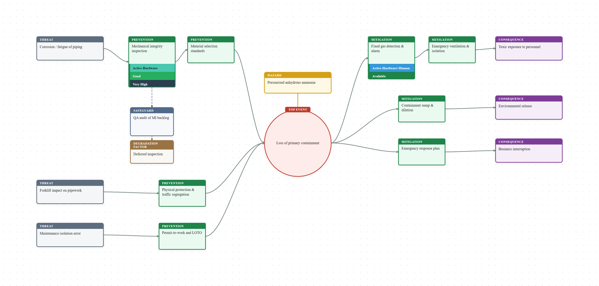
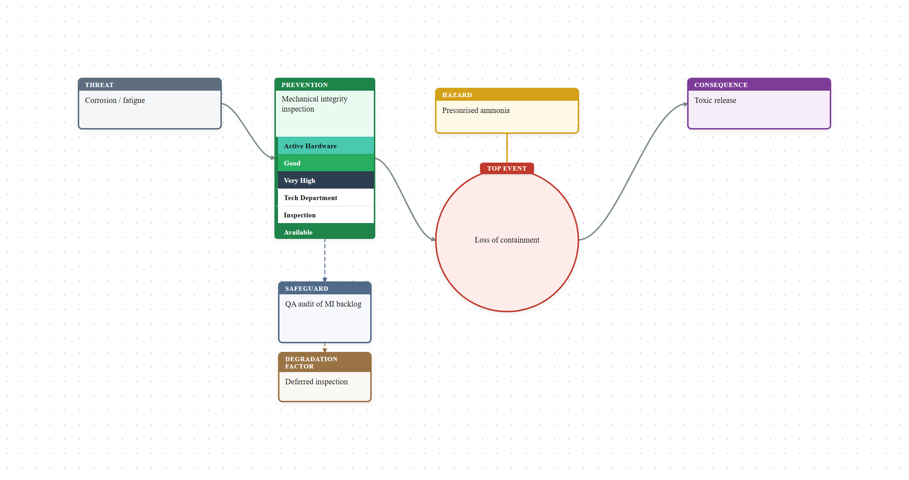

# O-Tie

Build and edit **risk bowtie diagrams** in Obsidian with an interactive visual editor. O-Tie is for **bowtie risk analysis** — a visual method used in process safety, operations, and HSE work to show how a hazard can lead to a top event (loss of control), which threats can cause it, which consequences may follow, and which barriers prevent or reduce harm.

Diagrams are stored as `.bowtie` files in your vault and auto-save as you edit.

## Screenshots



*A bowtie for a cold-storage ammonia loss-of-primary-containment scenario.*



*Per-barrier analysis stacks and escalation factors (safeguards and degradation factors).*

> Regenerate these images with `npm run screenshots` (requires `npx playwright install chromium` once).

## Features

- Interactive bowtie editor with fan-in/fan-out layout
- Threats, prevention barriers, top event, mitigation barriers, consequences, and hazard
- Escalation factors and escalation barriers
- Per-barrier analysis stacks (type, effectiveness, criticality, and custom rows)
- Toolbar: add elements, undo/redo, fit, zoom, PNG export, help
- Inspector panel for label, notes, and delete
- Pan and zoom on the canvas
- Auto-save to `.bowtie` files

## Bowtie structure

```
Threats → Prevention Barriers → Top Event → Mitigation Barriers → Consequences
                                      ↑
                                   Hazard
```

## Installation

### From Obsidian Community Plugins

1. Open **Settings → Community plugins**.
2. Turn off **Restricted mode** if needed.
3. Click **Browse**, search for **O-Tie**, and install.
4. Enable the plugin.

### Manual installation

1. Download `main.js`, `manifest.json`, and `styles.css` from the [latest release](https://github.com/Andre482/O-tie/releases).
2. Copy them into `<vault>/.obsidian/plugins/o-tie/`.
3. Reload Obsidian and enable **O-Tie** under **Settings → Community plugins**.

## Usage

1. Click the **bowtie** ribbon icon or run **O-Tie: Create new bowtie**.
2. Enter a name — a `.bowtie` file opens in the editor.
3. Edit on the diagram:
   - **Toolbar**: add threat, consequence, or barrier; fit; zoom; export; help
   - **Double-click** a node or title to rename
   - **Click** a node to inspect it in the bottom panel
   - **Right-click** for context menus
   - **Hover** nodes for quick add/delete buttons
   - **Drag** empty canvas space to pan; **scroll** to zoom (desktop)
   - **Phone/tablet**: one finger to pan, two fingers to pinch zoom; toolbar +/− as fallback
   - **Delete** removes the selected node
   - **Ctrl+Z** / **Ctrl+Y** for undo and redo
4. Changes save automatically.

## Settings

Open **Settings → O-Tie** to configure:

- Default folder for new bowties
- Column gap, row gap, node width, and node height

## Obsidian Sync (phone and tablet)

`.bowtie` files are normal vault files, but **Obsidian Sync does not include custom extensions by default**. On **every device** (desktop, phone, and tablet):

1. Open **Settings → Sync → Selective sync** and enable **Sync all other types**.
2. Under **Vault configuration sync**, enable **Active community plugin list** and **Installed community plugins** so O-Tie is installed on mobile.
3. Confirm both devices use the **same remote vault** and no folder with `.bowtie` files is under **Excluded folders**.
4. Force-quit and reopen Obsidian after changing sync settings.

After updating O-Tie on desktop, let Obsidian Sync finish, then reload Obsidian on mobile so the plugin files (`main.js`, `styles.css`, `manifest.json`) update.

## Commands

| Command | Description |
|---------|-------------|
| Create new bowtie | Create a new `.bowtie` file |
| Open bowtie file | Open the active `.bowtie` file in the editor |
| Export bowtie as image | Export the diagram as PNG |

## File format

`.bowtie` files are JSON. The hazard and top event live inside `events`, and barriers can carry escalation chains and an analysis `stack`:

```json
{
  "id": "b1f2…",
  "name": "Defective steamcracker",
  "events": [
    {
      "id": "ev1",
      "label": "Loss of containment",
      "hazard": "High-pressure ethylene",
      "transitionBarriers": []
    }
  ],
  "threats": [
    {
      "id": "t1",
      "label": "Tube corrosion / fatigue",
      "preventionBarriers": [
        {
          "id": "pb1",
          "label": "Mechanical integrity inspection",
          "degradationChains": [],
          "stack": [
            { "id": "s1", "field": "type", "label": "Active Hardware", "color": "#48c9b0" }
          ],
          "stackCollapsed": false
        }
      ]
    }
  ],
  "consequences": [
    { "id": "c1", "label": "Fire / explosion", "mitigationBarriers": [] }
  ],
  "view": { "zoom": 1, "panX": 0, "panY": 0 },
  "createdAt": "2026-06-12T00:00:00.000Z",
  "updatedAt": "2026-06-12T00:00:00.000Z"
}
```

Files written by older versions (with top-level `hazard`/`topEvent` and barrier `escalationFactors`) are migrated automatically on open.

See [examples/steamcracker.bowtie](examples/steamcracker.bowtie) and [examples/cold-storage-ammonia.bowtie](examples/cold-storage-ammonia.bowtie).

## Changelog

See [CHANGELOG.md](CHANGELOG.md).

## Development

```bash
npm install
npm run dev        # watch mode
npm run build      # production build
npm run lint       # Obsidian plugin guidelines check
npm test           # unit tests (model + layout)
npm run screenshots # regenerate README images (needs: npx playwright install chromium)
npm run examples   # regenerate example .bowtie files
```

See [CONTRIBUTING.md](CONTRIBUTING.md) for setup, asset regeneration, and the release/QA checklist.

## Third-party licenses

This plugin bundles [html-to-image](https://github.com/bubkoo/html-to-image) (MIT) for PNG export.

## License

MIT — see [LICENSE](LICENSE).
